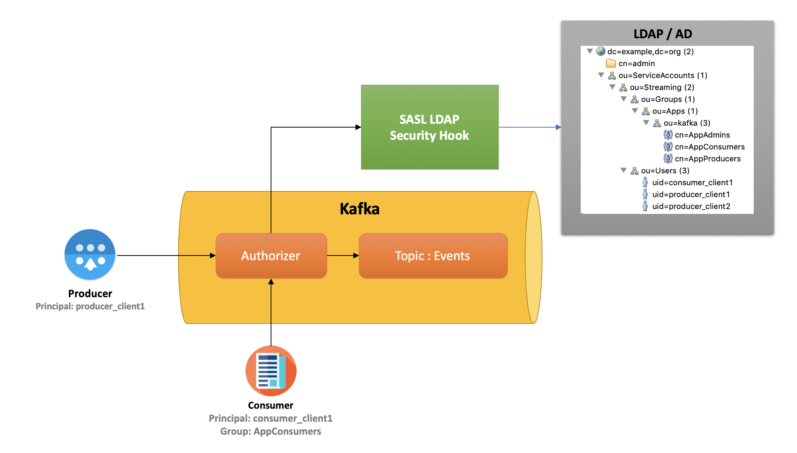

# Kafka LDAP Security Hook
Kafka LDAP Security



Introduction:
To enable security in Kafka we can use SASL. SASL is a pluggable implementation where different mechanisms like PLAIN, SCRAM, GSSAPI, OAUTHBEARER or custom implementations can be used.

SASL allows Kafka to authenticate producers & consumers. ACLs allows these clients to perform different operations like read, write, describe etc on topics.

Kafka LDAP Security Hook is an extension of SASL PLAIN mechanism which enables following:
1. Allow Kafka to authenticate clients against LDAP
2. Perform group level ACLs authorizations

# Installation
1. To enable this hook we have to download the kafka-ldap-hook.jar file in Kafka library folder.
2. Provision LDAP properties like URL, Bind DN user and password, base DN for users and groups

# Setup AD/LDAP Test Docker Instance
```
docker run -p 389:389 -p 636:636 --name my-openldap-container --volume [PATH_TO_LDAP_LDIF]/UsersAndGroups.ldif:/container/service/slapd/assets/config/bootstrap/ldif/50-bootstrap.ldif --detach osixia/openldap:1.2.3 --copy-service --loglevel debug
```

## LDAP With SSL
```
docker run --hostname ldap.edp.com --env LDAP_TLS_VERIFY_CLIENT="try" -p 389:389 -p 636:636 --name my-openldap-container --volume /home/vint/Desktop/ldap-server/UsersAndGroups.ldif:/container/service/slapd/assets/config/bootstrap/ldif/50-bootstrap.ldif --detach osixia/openldap:1.2.3 --copy-service --loglevel debug

after that you'll be able to connect SSL to port 636 (also will need to change in yaml file sslEnabled flag )
```

# Setup Zookeeper
```
a.export KAFKA_OPTS="-Djava.security.auth.login.config=[PATH_TO_KAFKA]/config/zookeeper_server_jaas.conf"
b.[PATH_TO_KAFKA]/bin/zookeeper-server-start.sh [PATH_TO_KAFKA]/config/zookeeper.properties
```

# Setup Broker
## Broker Configuration - server.properties
```
broker.id=0
listeners=SASL_PLAINTEXT://localhost:9092

# Security
security.inter.broker.protocol=SASL_PLAINTEXT
sasl.mechanism.inter.broker.protocol=PLAIN
sasl.enabled.mechanisms=PLAIN

# LDAP Security Hook
listener.name.sasl_plaintext.plain.sasl.server.callback.handler.class=com.insightlake.edp.kafka.security.authentication.SimpleLDAPAuthentication
authorizer.class.name=com.insightlake.edp.kafka.security.authorization.SimpleLDAPAuthorizer

super.users=User:admin
num.network.threads=3
num.io.threads=8
socket.send.buffer.bytes=102400
socket.receive.buffer.bytes=102400
socket.request.max.bytes=104857600
log.dirs=/tmp/kafka-logs
num.partitions=1
num.recovery.threads.per.data.dir=1
offsets.topic.replication.factor=1
transaction.state.log.replication.factor=1
transaction.state.log.min.isr=1
log.retention.hours=168
log.segment.bytes=1073741824
log.retention.check.interval.ms=300000

zookeeper.connect=localhost:2181
zookeeper.connection.timeout.ms=6000
group.initial.rebalance.delay.ms=0
```
## Broker JAAS File For SASL
```
KafkaServer {
   org.apache.kafka.common.security.plain.PlainLoginModule required
   username="admin"
   password="admin"
   user_admin="admin";
};
Client {
   org.apache.kafka.common.security.plain.PlainLoginModule required
   username="admin"
   password="admin-secret";
}
```

## LDAP Config
```
#host of the LDAP server
host: 127.0.0.1
#port of the LDAP server
port: 389
# connectionTimout in milliseconds for LDAP
connTimeout: 5000
# ssl enabled
sslEnabled: false
# userDN is <usrUid>=<usr>,<usrBaseDN>
# Placement of users in LDAP tree
usrBaseDN: ou=Users,ou=ApplAccounts,ou=ServiceAccounts,dc=example,dc=org
# Used for admin user only
adminBaseDN: dc=example,dc=org
adminUid: cn
# User attribute for DN completion
usrUid: uid
# groupDN is <grpUid>=<group>,<grpBaseDN>
# Placement of groups in LDAP tree
grpBaseDN: ou=Groups,ou=ApplAccounts,ou=ServiceAccounts,dc=example,dc=org
# Group attribute for DN completion
grpUid: cn
# Group membership is LDAP CompareRequest(groupDN, <grpAttrName>, userDN)
# Group membership attribute name
grpAttrName: member
# Lifetime of user entry in cache after cache-write - IN MINUTES
usrCacheExpire: 2
# Lifetime of group entry in cache after cache-write - IN MINUTES
grpCacheExpire: 4
```
## Start Broker
```
a.export KAFKA_OPTS="-Djava.security.auth.login.config=[PATH_TO_KAFKA]/config/kafka_server_jaas.conf -Dldapconfig.file.path=[PATH_TO_LDAPCONFIG_YAML]"
b.[PATH_TO_KAFKA]/bin/kafka-server-start.sh [PATH_TO_KAFKA]/config/server.properties
```

# Create Topic
```
./kafka-topics.sh --create --zookeeper localhost:2181 --replication-factor 1 --partitions 1 --topic events
```

# Setup ACLs
```
bin/kafka-acls.sh --authorizer kafka.security.auth.SimpleAclAuthorizer --authorizer-properties zookeeper.connect=localhost:2181 --add --allow-principal Group:AppProducers --operation Describe --topic events
```
# Setup Producer
```
KafkaClient {
  org.apache.kafka.common.security.plain.PlainLoginModule required
  username="consumer_client1"
  password="cclient1";
};
```
## Run Producer
```
export KAFKA_OPTS="-Djava.security.auth.login.config=[PATH_TO_KAFKA]/config/kafka_client_producer_jaas.conf"
./kafka-console-producer.sh --broker-list localhost:9092 --topic test --producer.config ../config/producer.properties
```

# Setup Consumer
```
KafkaClient {
  org.apache.kafka.common.security.plain.PlainLoginModule required
  username="consumer_client1"
  password="cclient1";
};
```
## Run consumer
```
export KAFKA_OPTS="-Djava.security.auth.login.config=config/kafka_client_consumer_jaas.conf"
/kafka-console-consumer.sh --bootstrap-server localhost:9092 --topic events --consumer.config ../config/consumer.properties --from-beginning
```

# Testing
Install InsightLake LDAP example docker from Docker Hub.
This docker image contains following users: producer_client1, producer_client2 and consumer_client1 etc.
It also includes groups like AppConsumers, AppProducers etc.

Install Kafka manually or using Docker image. Pass the LDAP configuration file in KAFKA_OPTS.

Create a topic test

Create ACLs for producer_client1, group: AppProducers using KafkaAcls command like:

Use Kafka Console producer and consumer to test the permissions.

License
------
InsightLake Data Platform is a commercial product but this hook is distributed to be used freely. Please contact contact@insightlake.com for details.

Getting Help
----------

You can get help easily :
Community - Google Groups
Slack Channel
Twitter
Facebook
Email: contact@insightlake.com

